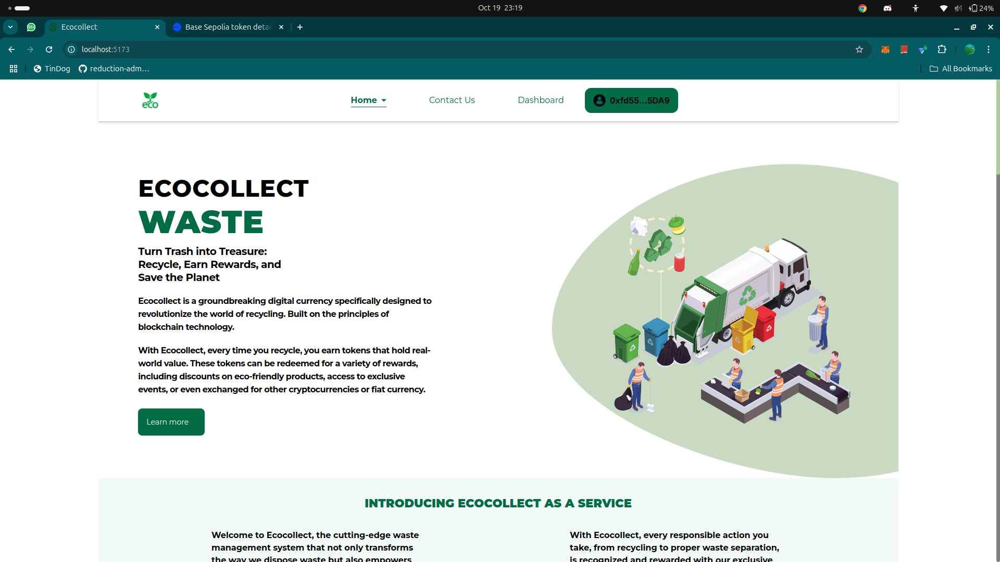
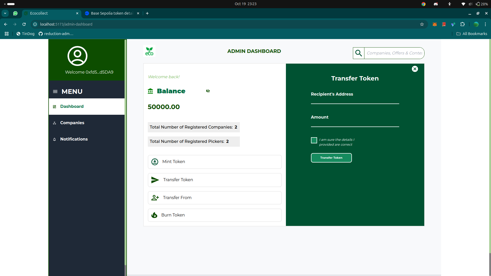
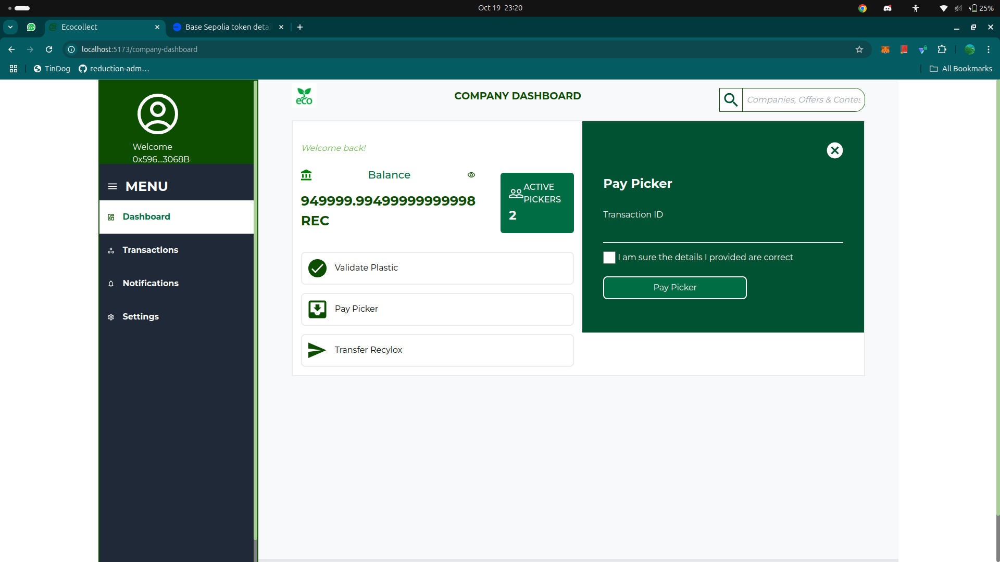
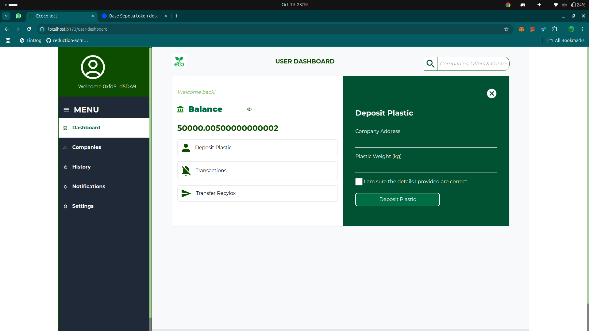
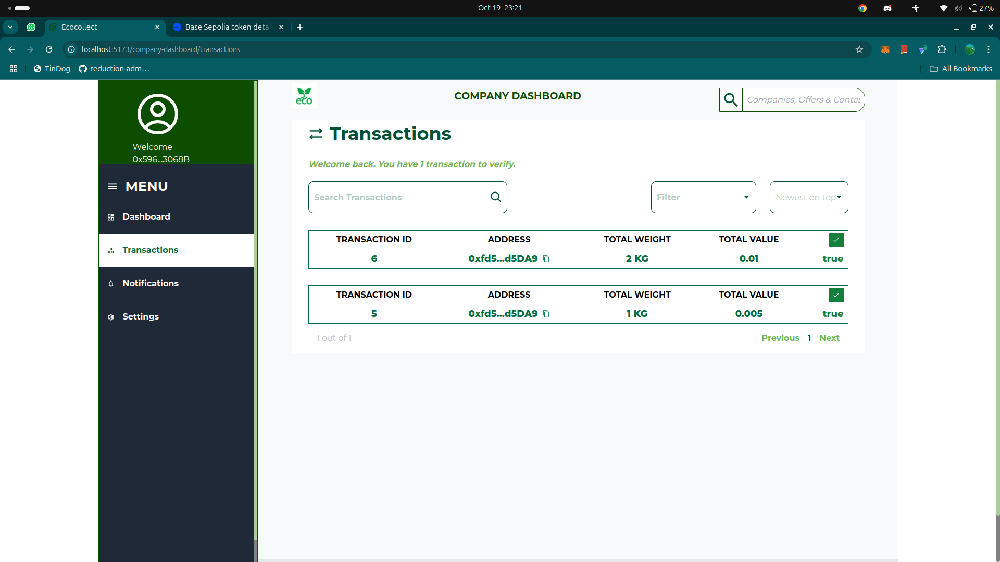

## EcoCollect

### Project Description
EcoCollect is an innovative decentralized application (dApp) designed to promote environmental sustainability by incentivizing the collection and recycling of plastic waste. The platform allows waste pickers to deposit collected plastics and receive payments from registered recycling companies, fostering a cleaner environment while rewarding individual efforts toward sustainability.

### Importance in Our Current Society
Plastic pollution is a critical global issue, with millions of tons of plastic waste ending up in oceans and landfills every year. EcoCollect offers a decentralized platform that addresses this problem by encouraging active participation in recycling. Through the use of blockchain technology, the platform ensures transparency, fairness, and traceability in waste management, providing a scalable, secure, and efficient solution to combat plastic waste globally.

### Base Chain’s Scalability, Security, and Fast Transactions
EcoCollect is deployed on Base, a highly scalable and secure Layer 2 chain that significantly enhances the platform's performance. With Base's fast transaction speeds, users can make plastic deposits and receive payments almost instantaneously, improving the user experience. Additionally, Base’s scalability allows the platform to handle high transaction volumes efficiently, ensuring EcoCollect can grow and support more users without compromising speed or security.

### Project Application and Usage
EcoCollect is primarily used by two key groups:
- **Pickers**: Individuals who collect plastic waste can register on the platform, deposit plastics, and receive tokens as rewards for their contributions.
- **Recycling Companies**: Companies can register to pay pickers for deposited plastics, ensuring that the collected waste is processed responsibly. 

By bridging decentralized technology with real-world environmental efforts, EcoCollect empowers users to contribute to a cleaner world while benefiting from the security and scalability of Base. Users can interact with the system through a user-friendly interface that provides dashboards for pickers and companies, enabling them to track deposits, payments, and transactions efficiently.

## Technologies Used
- **Solidity**: Smart contracts were written in solidity.
- **Hardhat**: Used to compile, deploy, and manage the smart contracts on the Base Sepolia testnet.
- **React**: To build the interactive frontend interface.
- ***OnChainKit***: For seamless on-chain interactions with the smart contracts.
- ***Coinbase Wallet***: Used for easy connection of wallet interaction.
- **Tailwind CSS**: To design a responsive and visually appealing frontend.
- ***Base Sepolia Testnet***: The blockchain environment where the contracts are deployed and tested.

## How to Install, Compile, and Deploy the Smart Contracts

1. **Navigate to the Blockend Directory**:
   ```bash
   cd Blockend
   ```

2. **Install Dependencies**: 
   ```bash
   npm install
   ```

3. **Set Up Environment Variables**:
   Create a `.env` file in the root directory and add your wallet key and Blockscout API key:
   ```plaintext
   WALLET_KEY=<your-wallet-key>
   BLOCKSCOUT_KEY=<your-blockscout-api-key>
   ```

4. **Compile**

    To compile the smart contracts, run:
    ```bash
    npx hardhat compile
    ```

5. **Deploy Contracts**:
   ```bash
   npx hardhat ignition deploy ./ignition/modules/deploy.ts --network base-sepolia
   ```

6. **Verify Contracts**:
   ```bash
   npx hardhat verify --network base-sepolia <deployed address>
   ```

### Deployed Contract Addresses
- **Recylox**: `0xacFfd04f690a7D718A23C07276c2bFCcF2Ee7E7A`
- **Recycle**: `0xD0BFe7253aB8EdCe6Fb46Eba473e13Ee9336aE82`

You can view the verified contracts on the Base Sepolia Block Explorer:
- [Recylox Contract](https://base-sepolia.blockscout.com/address/0xacFfd04f690a7D718A23C07276c2bFCcF2Ee7E7A#code)
- [Recycle Contract](https://base-sepolia.blockscout.com/address/0xD0BFe7253aB8EdCe6Fb46Eba473e13Ee9336aE82#code)

## Installation and Running the Frontend

### Project Application and Usage
The frontend allows users to:
- **Pickers**: Register, deposit collected plastics, and track payments received from recycling companies.
- **Recycling Companies**: Register, track picker deposits, and make payments for plastic deposits.
- **Transaction Management**: View and track all transactions between pickers and companies.
  
The interface includes the following pages:
- **Home Page**: Overview of the project and its environmental goals.
- **About Us Page**: Information on EcoCollect's mission and values.
- **Contact Us Page**: Details for contacting EcoCollect.
- **Picker Dashboard**: Display of picker activity, including plastic deposits and earnings.
- **Company Dashboard**: Display of company payments to pickers and the management of plastic collections.

### Technologies Used
- **React**: To build the dynamic and interactive user interface.
- **OnChainKit**: For handling on-chain transactions and interactions with the deployed smart contracts.
- **Tailwind CSS**: For designing a responsive and visually appealing frontend.
- **Vite**: As the build tool for fast frontend development and optimizations.

1. **Navigate to the Frontend Directory**:
   ```bash
   cd frontend
   ```

2. **Install Dependencies**:
   ```bash
   npm install
   ```

3. **Run the Frontend**:
   ```bash
   npm run dev
   ```

The frontend will be available at `http://localhost:5173`.

## Screenshots

1. **Home Page**  
   
   
2. **About Us Page**  
   

3. **Contact Us Page**  
   

4. **Picker Dashboard**  
   

5. **Company Dashboard**  
   

## contributors
1. Abdulyekeen Lukman
2. Olayiwola Saheed
